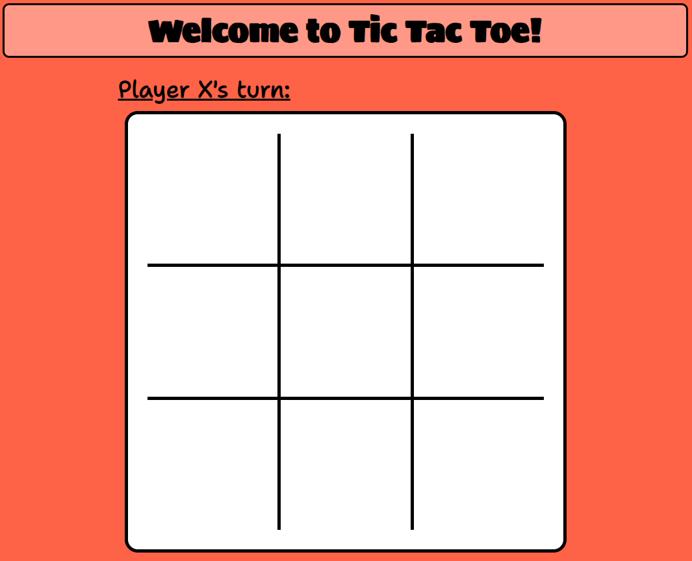
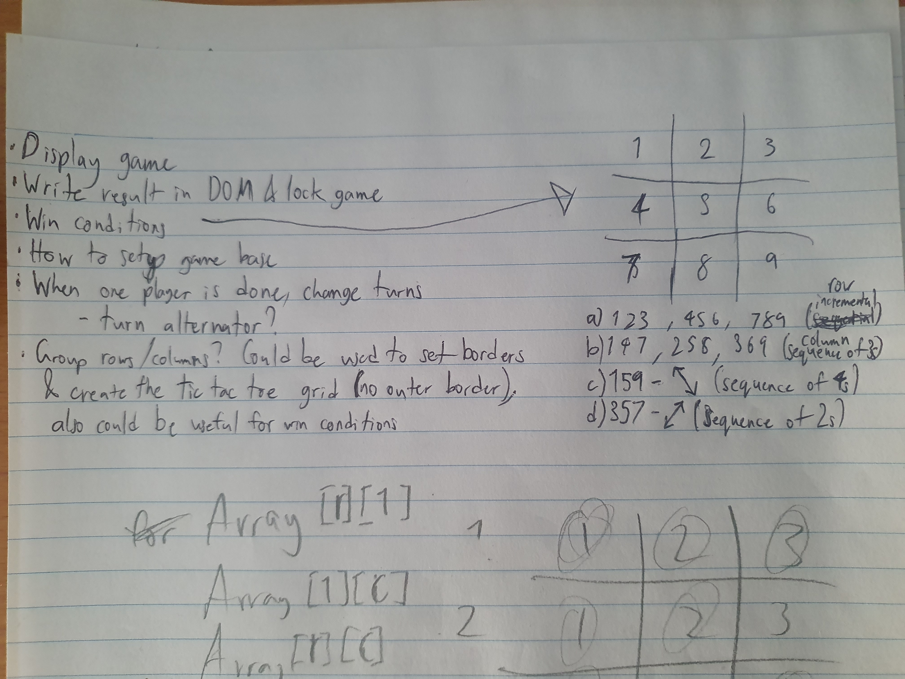
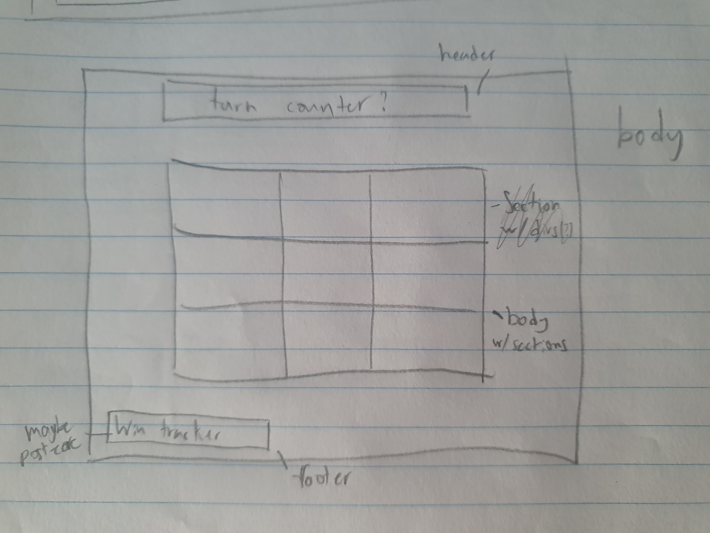
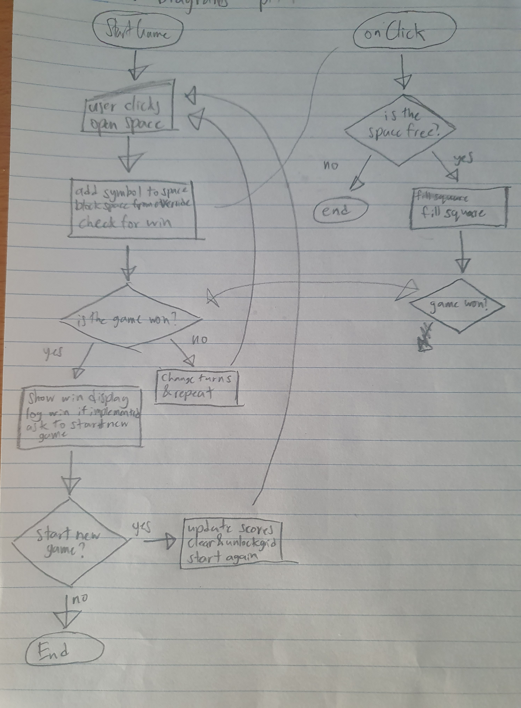
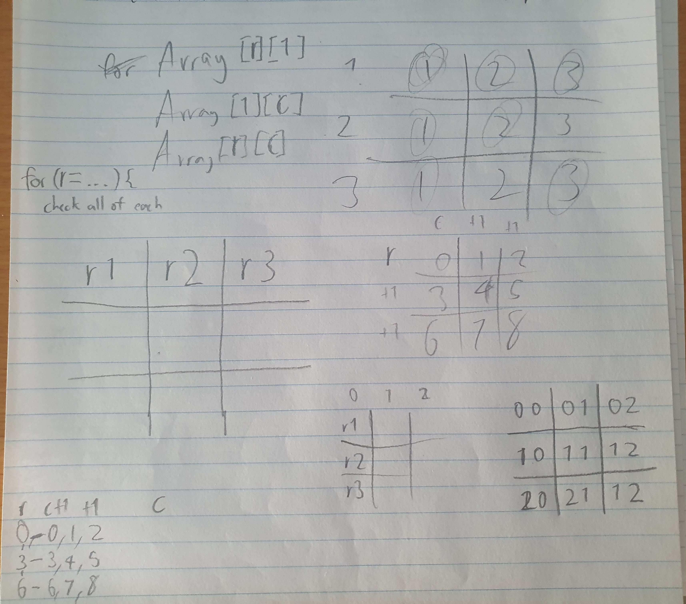

# tic_tac_toe
First project for SEIr62
## :computer: [Click here](https://kaipeps.github.io/tic_tac_toe/) to see my live project!
## :page_facing_up: About
- Just head to the above website and it's ready to go!

## :pencil: Planning & Problem Solving
- When I first got the brief for the project, I wanted to be sure I at least had the core of it planned out and ready to go before I started any code.

- I drew up a base wireframe for my CSS that ended up being essentially what I had in the final copy:

- I also drew up some simple flowcharts to cover the game logic, though this didn't end up covering all of my code as I initially wanted to be concise with it:

- In the end my main challenge simply ended up being the problem of how best to search for a win condition on each click! In the end I decided to go the long way around and simply search the whole grid for a win after each new click.
- It me some time to figure out how to search the grid for every win condition and I went through a few iterations of trial and error before I ended up marking it out similarly to a cartesian plane and using nested loops to search each set of 'co-ordinates' i.e. for each x, check each y; each y, check each x; check by both x & y simultaneously; then for x, searching y backwards (that one took a while to click!)

## :rocket: Cool tech
- For this project I used some HTML & CSS to create the core layout of the page but most of my work was in JavaScript to make it all work how I wanted it to.
- I decided to steer clear of animations for now as they were a relatively new concept for me and I was still getting my head around CSS as a whole. I didn't want to burn myself out on my first project!
- While it isn't anything overly complex, I am still proud of my cartesian plane solution as that was a problem that had me stumped for a good chunk of this project.
## :scream: Bugs to fix :poop:
- Handling a click & drag? Currently it changes the center square to an x and switches turn but doesn't actually add the classes to the section. (Fixed! It was because it registered as a click to thhe parent gamebox rather than a square, so adding an if to handle that possibility fixed that.)
- Another bug was found where if player X was to win on the final move, it registered as a draw unless it was a row win. (Also fixed! My code for the win check was originally written to return after each set of row/column/diagonal checks so as to save the computer from running it for every click. I then realised if X won in the final square on a column/diagonal check it would read 'not a row win' and move straight to checking for a draw. I removed the culprit and it now registers as it should no matter the win conditions.)
## :sob: Lessons learnt
If I could go back to the start I would:
- Have a read into more efficient ways to check win conditions based on WHERE exactly is clicked, i.e. on an x2-y1 click, only check row x2 & column y1 to save time & code (or maybe not code, it could be more efficient the way I have it now. I don't know but I would still love to read into other possibilities when my understanding on the language has improved!)
## :white_check_mark: Future features
If I were to continue expanding on this as a side project, I would:
- Do some media query work to make it playable from my phone on the go.
- Look into server-side storage to hold data between games.
- Do some reading on modal pop-ups and include one when the game is won to reset rather than just changing the turn text.